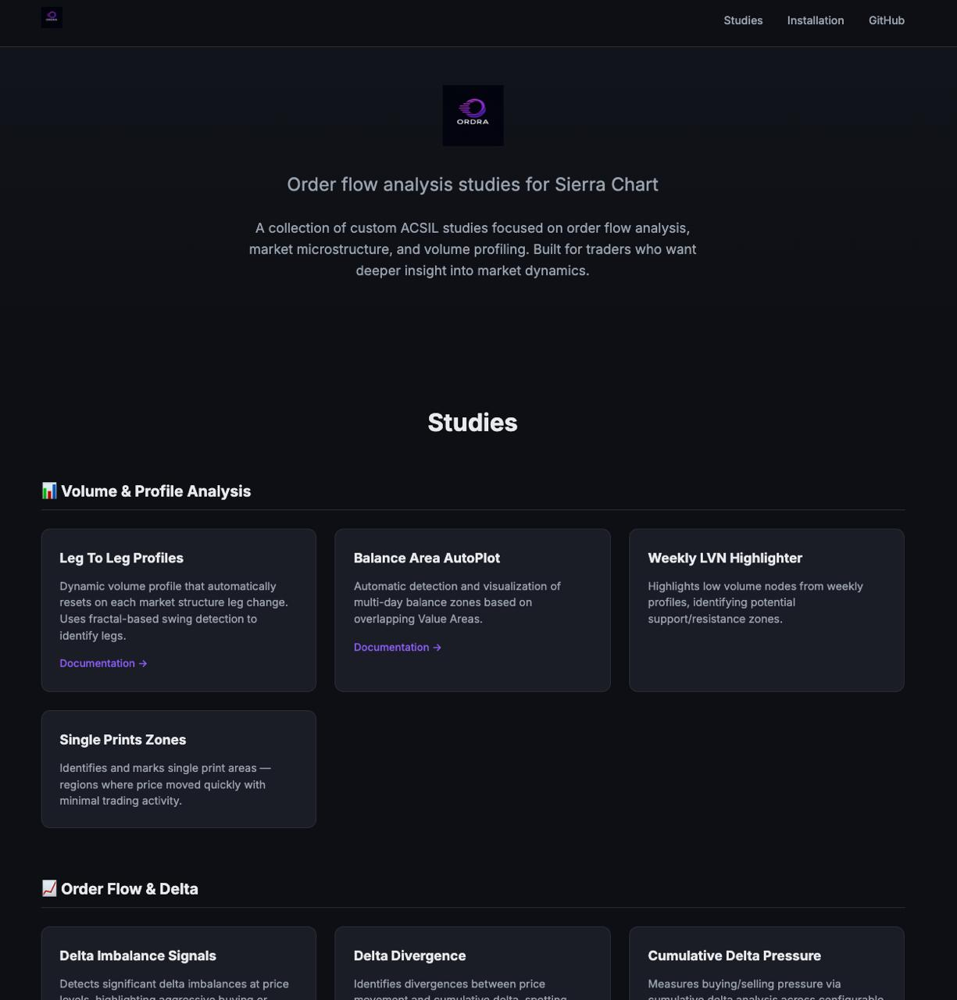

# Ordra Website

<p align="center">
  
</p>

<p align="center">
  <strong>Website for Ordra — Order flow analysis studies for Sierra Chart</strong>
</p>

<p align="center">
  <a href="https://ordralabs.github.io/ordra-site/">View Live Site →</a>
</p>

---

## Screenshot



---

## About

This is the marketing/documentation website for [Ordra](https://github.com/OrdraLabs/Ordra), a collection of custom ACSIL studies for Sierra Chart focused on:

- **Volume & Profile Analysis** — Leg-to-leg profiles, balance areas, LVN highlighting
- **Order Flow & Delta** — Delta imbalances, divergences, exhaustion detection
- **Market Depth & Liquidity** — Depth pressure, adverse selection, iceberg detection
- **Utilities** — Volume speed, threshold signals, sync tools

## Tech Stack

Pure HTML/CSS — no frameworks, no build step. Just clean, fast static files.

## Development

```bash
# Clone
git clone git@github.com:OrdraLabs/ordra-site.git
cd ordra-site

# Serve locally (Python)
python3 -m http.server 8000

# Open http://localhost:8000
```

## Deployment

Deployed via GitHub Pages from the `main` branch.

Live at: https://ordralabs.github.io/ordra-site/

---

<p align="center">
  <sub>© 2026 OrdraLabs</sub>
</p>
